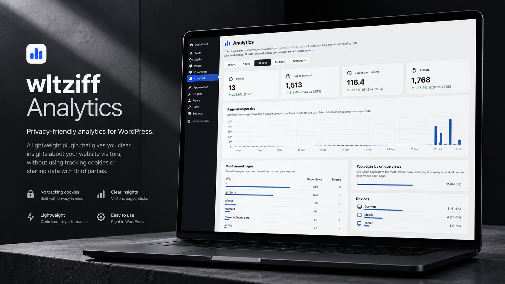
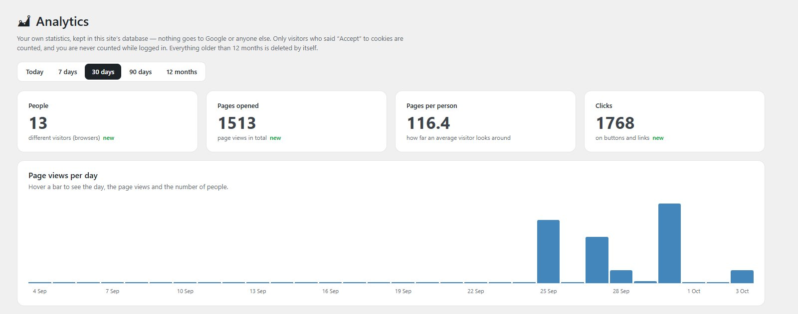
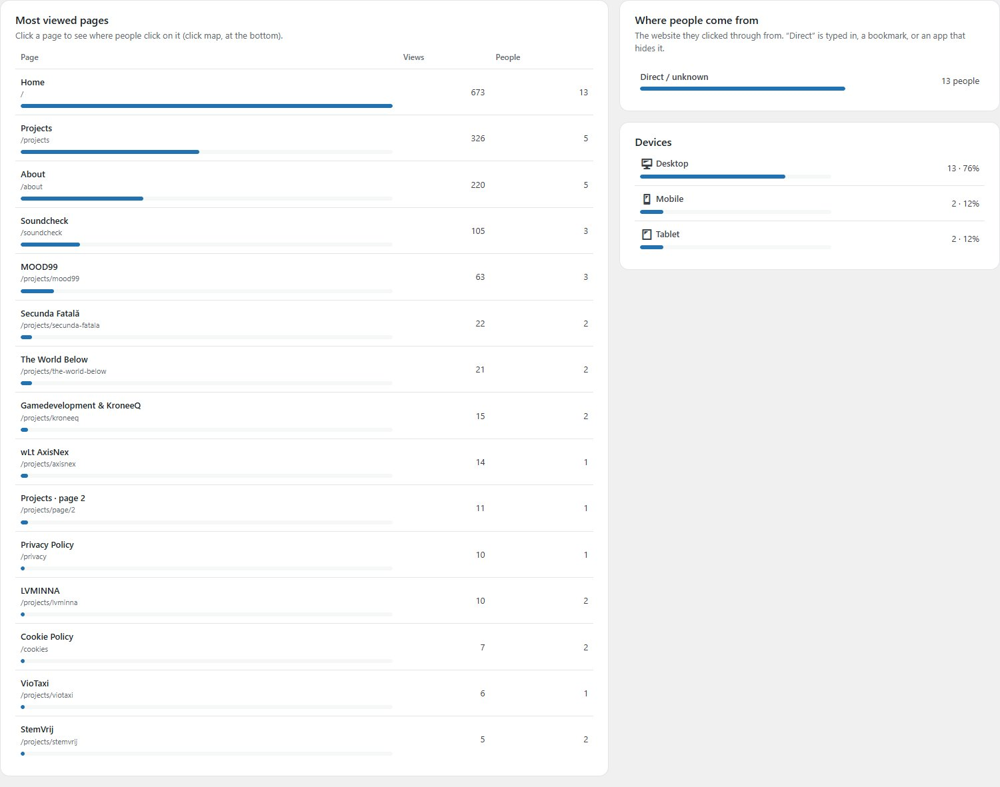
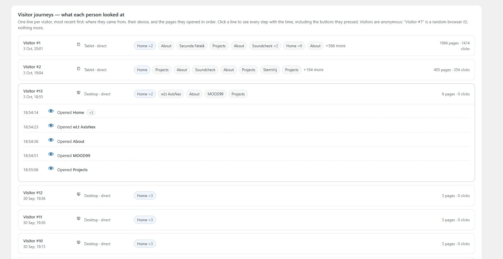
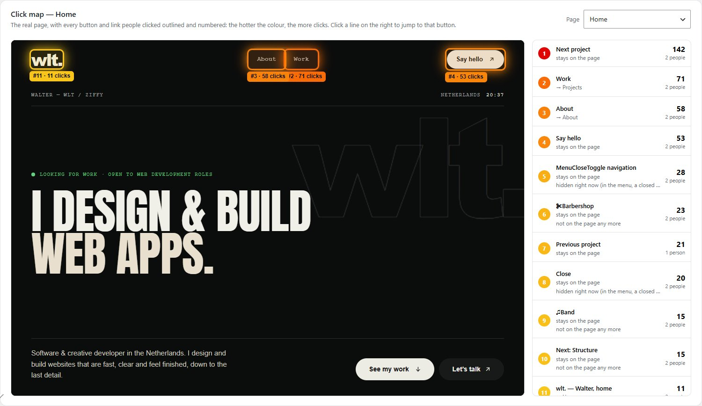
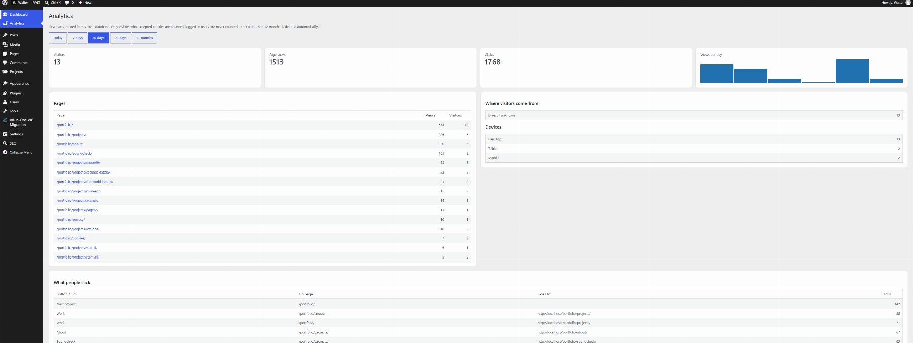

# wltziff Analytics

**A custom, privacy-first analytics dashboard I built for my own website, [wltziff.nl](https://wltziff.nl).**
No Google Analytics and no third-party trackers: the data lives in the site's own database, and the dashboard is
part of my custom WordPress theme.

Made by **Walter (wLt)**. This repository explains what the dashboard does and how I built it. The code itself is
part of my private theme and isn't published here.



> The screenshots show test data from my local development site, so the numbers are mine (lots of pages per
> person). On the live site they show real, anonymous visitors.

---

## Why I built my own

- **Privacy.** I didn't want my visitors' data going to Google or an ad network. Everything stays in my own
  database, and IP addresses are never stored.
- **Only what I need.** I want to know which projects people look at, how they move through the site and what they
  click, not hundreds of reports I'll never open.
- **It fits the site.** It's built into my theme, so it knows my pages by their real names ("MOOD99",
  "AxisNex") and works with my page transitions.

## What it shows

### Overview
First, one sentence that sums it all up: *"In the last 30 days, 13 people visited your site. Together they opened
1,807 pages and pressed 1,974 buttons or links. The page they opened most: Home."* Then the four numbers that
matter, each explained in plain words and compared with the period before ("▲ 12% more than the 30 days before"):
**visitors**, **pages opened**, **pages per visitor** and **clicks**. Underneath is a chart of visits per day,
including the quiet days. Point at a bar to see the date, the views and the number of people. You can switch between
today, 7 days, 30 days, 90 days and 12 months.

### Most viewed pages, sources and devices


Pages are listed by their real names, with the address underneath and a bar for their share. Pages that were
renamed add up under their new name (my INPUT ZERO project became **AxisNex**, and its old visits count for the
new name). Pages I deleted from the site are **left out** of every list, the journeys and the click map, so the
dashboard only shows what still exists. Next to the pages you can see where people come from and which devices they use.

### Visitor journeys: what each person looked at


One line per visitor, most recent first: their device, where they came from, and the pages they opened **in
order** (Home → AxisNex → About → MOOD99 → Projects). Open a line to see every step with its time, including
the buttons they pressed ("Clicked “Work” on Home → Projects"). The same step repeated straight away (a reload,
a double click) shows as one line with "×2", and a return visit later shows as "came back 2 hours later".

Visitors are anonymous: "Visitor #7" is a random ID stored in their browser, nothing more.

### Click map


The real page, with every button and link people clicked **outlined in a heat colour** (red = most clicks) and
labelled with its rank and count ("#2 · 71 clicks"). On the right is the ranked list. Click a line and the preview
scrolls to that button and pulses it. Buttons that are hidden right now (inside the menu, a closed panel, another
slide) or no longer exist are marked as such instead of being drawn in the wrong place.

---

## Before and after

The first version worked, but it was hard to read: pages showed as raw addresses (`/portfolio/projects/mood99/`),
the chart had no dates, there was no way to see what a single visitor did, and the click map was red dots on a
stretched-out page preview that didn't match what visitors actually saw.

**Before:**



**What I changed:**

| Before | After |
|---|---|
| Raw addresses (`/portfolio/projects/mood99/`) | Real page names ("MOOD99"), renamed pages recognised |
| Totals only | Each number explained, compared with the period before |
| A small chart without dates | Every day of the period, dated, with details on hover |
| No idea what one person did | **Visitor journeys**: every visitor's path, step by step |
| Red dots on a distorted page preview | **Click map** on the real page: buttons outlined by heat, ranked, clickable |
| Plain tables | Cards, share bars, a clear hierarchy, works on smaller screens |
| Old, deleted pages in every list | Only pages that still exist; renamed ones merged |
| Technical labels ("Page views", "+12% vs previous") | Plain words and an "In short" summary anyone can read |

## How it works

```text
Visitor accepts cookies ──► small script on the page (first-party)
                              │  a page view, or a click on a button / link
                              ▼
                        the site's own API endpoint ──► filters out bots and logged-in users
                              ▼
                        a table in the site's database (no IP address)
                              ▼
                        WordPress admin → Analytics (this dashboard)
```

- **Consent first.** Nothing is recorded unless the visitor presses "Accept" in the cookie notice. Declining
  removes the visitor ID straight away.
- **What's stored per event:** time, a random visitor ID, page, the button's text and where it leads (for clicks),
  the referring website's domain, device type (mobile / tablet / desktop) and the click position. **No IP address,
  name or email.**
- **Not counted:** bots and crawlers, and me while I'm logged in.
- **Kept for 12 months**, then deleted automatically by a daily clean-up.
- **The click map** loads the real page (same site, so the dashboard can look inside it), finds every clicked
  button the same way the tracker named it, switches off the page's animations so everything sits in its final
  place, and draws the outlines and labels on top.

## Built with

- **WordPress** (a custom admin page inside my own theme) and **PHP**
- **MySQL**: a custom table with indexes for date and page
- The **WordPress REST API** for collecting events
- **Vanilla JavaScript** for tracking, the click map overlay and the interactions. No libraries and no charting
  package: the chart is plain HTML and CSS.

## More

- My portfolio: **[wltziff.nl](https://wltziff.nl)**
- How the whole site was built: **[wltziff-portfolio](https://github.com/wlt1920/wltziff-portfolio)**
- Contact: wltcollabs@gmail.com · [LinkedIn](https://www.linkedin.com/in/walter-argint-636b53263/)

© 2026 Walter (wLt). Custom-built for wltziff.nl.
